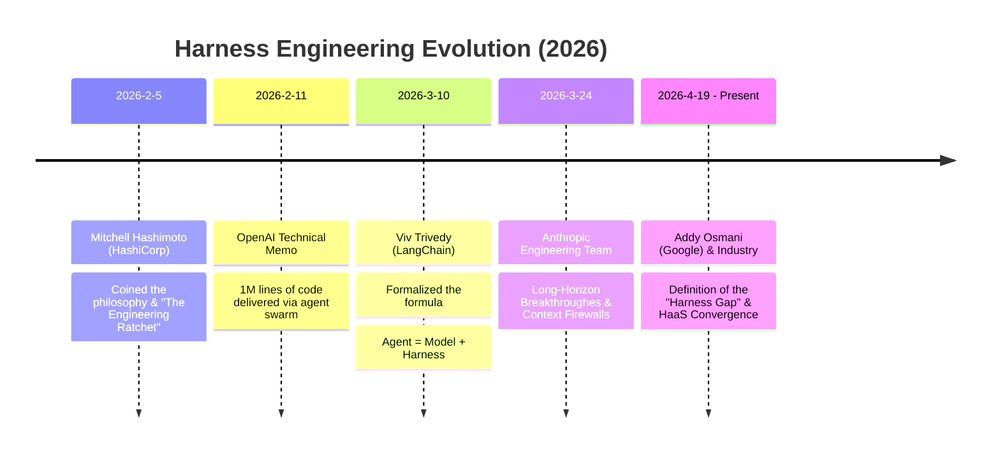

# awesome-agent-harness 🤖

> A curated list of agent harnesses, agent frameworks, workflow frameworks, and emerging agent protocols.

`awesome-agent-harness` is a curated map of the modern AI agent ecosystem. It focuses on developer-facing agent products, agent-building frameworks, workflow orchestration tools, and the protocols shaping how agents interact with tools, UIs, and each other.

This repository is designed for builders, researchers, and anyone trying to answer questions like:

- Which agent products are worth tracking right now? 👀
- Which framework should I choose to build an agent system? 🧰
- Where is the boundary between agent frameworks and workflow frameworks? 🔀
- Which protocols may become core ecosystem standards? 🌐

## 📅 The Evolution Timeline (2026)

The emergence of **Harness Engineering** marks a paradigm shift in the AI Agent landscape: moving from *“Prompt Tuning & Model Obsession”* to *“Rigid Scaffolding & Environment Constraints”*. 

Here is how the discipline converged in early 2026:





### 1. The Spark: Philosophy & The Ratchet Effect
* **Date:** 2026-2-5
* **Key Figure:** Mitchell Hashimoto (Co-founder of HashiCorp)
* **Milestone:** Borrowed the concept of a *"Test Harness"* from traditional software engineering. He proposed the **"Engineer the Harness"** philosophy: *Whenever an agent slips, stop blaming the model weights or tweaking prompts. Instead, spend time engineering a rigid environmental constraint so the agent can never make that exact mistake again.* This introduced the concept of the **Engineering Ratchet** to AI development.

### 2. The Validation: Enterprise-Scale Production
* **Date:** 2026-2-11
* **Key Organization:** OpenAI
* **Milestone:** Published the seminal report [《Harness engineering: leveraging Codex in an agent-first world》](https://openai.com/index/harness-engineering/). They open-sourced their post-mortem of a project where an autonomous agent swarm delivered **1 million lines of production code** in 5 months with zero human coding. It proved that Mitchell's harness-constraint philosophy scales remarkably to massive, complex software architectures.

### 3. The Anatomy: Standardization & The Formula
* **Date:** 2026-3-10
* **Key Figure:** [Viv Trivedy](https://www.langchain.com/blog/the-anatomy-of-an-agent-harness) (LangChain Team)
* **Milestone:** Published [“The Anatomy of an Agent Harness”](https://www.langchain.com/blog/the-anatomy-of-an-agent-harness). Viv formalized the chaotic industry practices into an elegant architectural equation:
  $$\text{Agent} = \text{Model} + \text{Harness}$$
  He mapped out the 6 foundational atomic components of a modern harness (Filesystem/Git, Boxed Bash, Context Compaction, Lifecycle Hooks, Search, and Multi-Agent Orchestration), transforming the black magic of agent tuning into a rigorous engineering discipline.

### 4. The Long-Horizon Breakthrough: Context Firewalls
* **Date:** 2026-3-24
* **Key Organization:** [Anthropic Engineering Team](https://www.anthropic.com/engineering/harness-design-long-running-apps)
* **Milestone:** As agents tackled multi-day tasks, the industry hit the wall of **Context Rot** (reasoning decay as context windows fill up). [Anthropic](https://www.anthropic.com/engineering/harness-design-long-running-apps) stepped in with breakthrough paradigms for long-running work:
  * **Full Context Resets:** Tearing down bloated sessions and rebuilding them from a compact, structured *Hand-off File*.
  * **Planner/Generator/Evaluator Splits:** Enforcing a *Sprint Contract* at the harness level to prevent agents from grading their own work ("GANs for code").

### 5. The Convergence: Harness-as-a-Service (HaaS)
* **Date:** 2026-4-19
* **Key Figure/Trend:** [Addy Osmani](https://addyosmani.com/blog/agent-harness-engineering/) (Google) & Cloud Providers
* **Milestone:** [Addy Osmani](https://addyosmani.com/blog/agent-harness-engineering/) published the definitive overview [“Agent Harness Engineering”](https://addyosmani.com/blog/agent-harness-engineering/), declaring that *"The gap between what today's models can do and what you see them doing is largely a harness gap."* This led directly to the **HaaS (Harness-as-a-Service)** era. With the launch of the Claude Agent SDK and OpenAI Agents SDK, the industry shifted from building raw LLM completion loops to configuring robust, managed agent runtimes out of the box.

---

*“Every component in a harness encodes an assumption about what the model can’t do on its own.” — Anthropic. As models evolve, the scaffolding doesn't shrink—it moves to higher ceilings.*


## Contents 📚

- [Agent Harness](#agent-harness-)
- [Agent Framework](#agent-framework-)
- [Workflow Framework](#workflow-framework-)
- [AgentOps / Observability](#agentops--observability-)
- [Protocol](#protocol-)
- [Roadmap](#roadmap-)
- [Contributing](#contributing-)
- [License](#license-)

## Agent Harness 🚀

Agent harnesses are end-user or developer-facing products that package model access, tools, execution loops, memory, planning, coding assistance, browser automation, or task execution into a usable experience.

| Product | Release Date | Developer / Organization | Open Source |
| --- | --- | --- | --- |
| [Cursor](https://cursor.com/) | 2023-01 | Anysphere | No |
| [AutoGPT](https://github.com/Significant-Gravitas/AutoGPT) | 2023-03 | Significant Gravitas | Yes |
| [BabyAGI](https://github.com/yoheinakajima/babyagi) | 2023-04 | Yohei Nakajima | Yes |
| [Cody](https://sourcegraph.com/cody) | 2023-05 | Sourcegraph | No |
| [Aider](https://aider.chat/) | 2023-05 | Paul Gauthier | Yes |
| [Sweep](https://github.com/sweepai/sweep) | 2023-05 | Sweep AI | Yes |
| [Continue](https://github.com/continuedev/continue) | 2023-06 | Continue, Inc. | Yes |
| [GPT Engineer](https://github.com/antonosika/gpt-engineer) | 2023-06 | Lovable | Yes |
| [GPT Pilot](https://github.com/Pythagora-io/gpt-pilot) | 2023-08 | Pythagora | Yes |
| [Tongyi Lingma](https://lingma.aliyun.com/) | 2023-10 | Alibaba | No |
| [v0.dev](https://v0.dev/) | 2023-10 | Vercel | No |
| [Plandex](https://github.com/plandex-ai/plandex) | 2024-02 | Plandex | Yes |
| [Devin](https://devin.ai/) | 2024-03 | Cognition Labs | No |
| [OpenHands (OpenDevin)](https://github.com/All-Hands-AI/OpenHands) | 2024-03 | All Hands AI | Yes |
| [Amazon Q Developer](https://aws.amazon.com/q/developer/) | 2024-04 | Amazon | No |
| [SWE-agent](https://github.com/SWE-agent/SWE-agent) | 2024-04 | Princeton University NLP Group | Yes |
| [Cline](https://cline.bot/) | 2024-06 | Cline | Yes |
| [OpenCode](https://opencode.ai/) | 2024-07 | Anomaly Innovations | Yes |
| [PearAI](https://trypear.ai/) | 2024-07 | PearAI | Yes |
| [Void](https://voideditor.com/) | 2024-08 | Void Editor Team | Yes |
| [Replit Agent](https://replit.com/ai) | 2024-09 | Replit | No |
| [Pythagora](https://pythagora.ai/) | 2024-10 | Pythagora | No |
| [Bolt.new](https://bolt.new/) | 2024-10 | StackBlitz | No |
| [bolt.diy](https://github.com/stackblitz-labs/bolt.diy) | 2024-10 | StackBlitz | Yes |
| [OpenCUA](https://github.com/ModelBest/OpenCUA) | 2024-10 | ModelBest | Yes |
| [Lovable](https://lovable.dev/) | 2024-11 | Lovable | No |
| [Windsurf](https://windsurf.com/) | 2024-11 | Codeium -> Cognition Labs | No |
| [Amp](https://ampcode.com/) | 2024-11 | Sourcegraph | No |
| [browser-use](https://browser-use.com/) | 2024-11 | Browser Use Inc. | Yes |
| [agent-browser](https://agent-browser.io/) | 2024-12 | Emergence | Yes |
| [Roo Code](https://roocode.com/) | 2025-01 | Roo Code | Yes |
| [Trae](https://www.trae.ai/) | 2025-01 | ByteDance | No |
| [Pi Coding Agent](https://github.com/badlogic/pi-mono) | 2025-01 | Mario Zechner | Yes |
| [Goose](https://block.github.io/goose/) | 2025-01 | Block | Yes |
| [Crush](https://github.com/charmbracelet/crush) | 2025-01 | Crush AI | Yes |
| [Claude Code](https://docs.claude.com/en/docs/claude-code/overview) | 2025-02 | Anthropic | Yes* |
| [GitHub Copilot](https://github.com/features/copilot) | 2025-02 | GitHub | Yes |
| [Manus](https://manus.im/) | 2025-03 | Butterfly Effect | No |
| [OpenManus](https://github.com/FoundationAgents/OpenManus) | 2025-03 | MetaGPT | Yes |
| [Genspark Super Agent](https://www.genspark.ai/) | 2025-04 | Genspark | No |
| [Codex CLI](https://github.com/openai/codex) | 2025-04 | OpenAI | Yes |
| [Gemini CLI](https://github.com/google-gemini/gemini-cli) | 2025-06 | Google | Yes |
| [CodeBuddy](https://www.codebuddy.ai/docs/ide/Introduction) | 2025-07 | Tencent | No |
| [trae-agent](https://github.com/bytedance/trae-agent) | 2025-07 | ByteDance | Yes |
| [Qwen Code](https://github.com/QwenLM/qwen-code) | 2025-07 | Alibaba | Yes |
| [Deep Agents](https://github.com/langchain-ai/deepagents) | 2025-07 | LangChain | Yes |
| [Qoder](https://qoder.com/) | 2025-08 | Alibaba | No |
| [Open SWE](https://github.com/langchain-ai/open-swe) | 2025-08 | LangChain | Yes |
| [AstrBot](https://github.com/astrbotdevs/astrbot) | 2025-09 | AstrBotDevs | Yes |
| [OpenClaw](https://github.com/openclaw/openclaw) | 2025-11 | Peter Steinberger | Yes |
| [NanoClaw](https://github.com/qwibitai/nanoclaw) | 2026-01 | NanoCo | Yes |
| [Hermes](https://github.com/nousresearch/hermes-agent) | 2026-02 | Nous Research | Yes |
| [Warp](https://github.com/warpdotdev/warp) | 2026-04 | Warp | Yes |

`Yes*` indicates a partially open-source, open-core, or otherwise limited open-source model.

## Agent Framework 🧠

Agent frameworks are developer toolkits for building agent systems. They usually cover capabilities like prompt orchestration, tool calling, memory, planning, state management, evaluation, and multi-agent coordination.

| Framework | Developer / Organization | Language | Release Date |
| --- | --- | --- | --- |
| [Haystack](https://haystack.deepset.ai/) | deepset | Python | 2019-11 |
| [LlamaIndex](https://www.llamaindex.ai/) | LlamaIndex | Python / TypeScript | 2022-11 |
| [DSPy](https://dspy.ai/) | Stanford NLP | Python | 2023-01 |
| [Semantic Kernel](https://github.com/microsoft/semantic-kernel) | Microsoft | C# / Python / Java | 2023-03 |
| [Camel-AI](https://www.camel-ai.org/) | KAUST / Open Source | Python | 2023-03 |
| [Agno (Phidata)](https://docs.agno.com/) | Agno team | Python | 2023-05 |
| [Vercel AI SDK](https://sdk.vercel.ai/) | Vercel | TypeScript | 2023-06 |
| [Instructor](https://python.useinstructor.com/) | Jason Liu | Python / TypeScript / Go / Rust | 2023-07 |
| [MetaGPT](https://github.com/FoundationAgents/MetaGPT) | MetaGPT Team / DeepWisdom | Python | 2023-07 |
| [AutoGen](https://github.com/microsoft/autogen) | Microsoft Research | Python / C# | 2023-09 |
| [ModelScope-Agent](https://github.com/modelscope/modelscope-agent) | Alibaba | Python | 2023-09 |
| [Letta (MemGPT)](https://www.letta.com/) | Letta / UC Berkeley team | Python | 2023-10 |
| [CrewAI](https://www.crewai.com/) | CrewAI Inc. | Python | 2023-11 |
| [LangGraph](https://www.langchain.com/langgraph) | LangChain | Python / TypeScript | 2024-01 |
| [Rig](https://github.com/0xPlaygrounds/rig) | Jetpack.io | Rust | 2024-04 |
| [Bee Agent Framework](https://framework.beeai.dev/) | IBM | TypeScript | 2024-08 |
| [Eino](https://github.com/cloudwego/eino) | ByteDance | Go | 2024-10  |
| [PydanticAI](https://ai.pydantic.dev/) | Pydantic | Python | 2024-12 |
| [Pi Agent Core](https://github.com/badlogic/pi-mono) | Mario Zechner | TypeScript | 2025-01 |
| [OpenAI Agents SDK](https://platform.openai.com/docs/guides/agents-sdk) | OpenAI | TypeScript / Node / Python / Go | 2025-03 |
| [Google ADK](https://google.github.io/adk-docs/) | Google | Python / Java / TypeScript / Go | 2025-04 |
| [Claude Agent SDK](https://docs.claude.com/en/api/agent-sdk/overview) | Anthropic | Python / TypeScript | 2025-06 |
| [Microsoft Agent Framework](https://learn.microsoft.com/en-us/agent-framework/overview/) | Microsoft | Python / C# | 2025-10 |

## Workflow Framework 🔄

Workflow frameworks are useful for orchestration, scheduling, stateful execution, observability, and visual flow design. They are not always agent-first, but they often serve as the execution backbone for agent systems.

| Framework | Developer / Organization | Language | Release Date |
| --- | --- | --- | --- |
| [Prefect](https://www.prefect.io/) | Prefect Technologies | Python | 2019-03 |
| [Temporal](https://temporal.io/) | Temporal Technologies | Go / Python / Java / TypeScript | 2020-10 |
| [Hamilton](https://www.dagworks.io/) | Stitch Fix / DagWorks | Python | 2021-10 |
| [Yao](https://yaoapps.com/) | IQS | Go / JavaScript | 2022-11 |
| [Langflow](https://www.langflow.org/) | DataStax | Python | 2023-04 |
| [Flowise](https://flowiseai.com/) | FlowiseAI | TypeScript | 2023-04 |
| [Dify](https://dify.ai/) | LangGenius | Python | 2023-05 |
| [Coze](https://www.coze.com/) | ByteDance | Go | 2023-12 |
| [Burr](https://github.com/dagworks-inc/burr) | DagWorks | Python | 2024-03 |

## AgentOps / Observability 📈

AgentOps and observability tooling help teams monitor, debug, evaluate, and improve agent behavior in production. These tools typically provide traces, session replay, cost/token monitoring, prompt/version tracking, and quality evaluation pipelines.

Common capability buckets:

- **Tracing & replay**: inspect each step (prompt, tool call, model response, latency) of an agent run.
- **Evaluation**: run online/offline eval sets, track regressions, and compare prompt/model/agent versions.
- **Cost & performance**: monitor token usage, model spend, error rate, and tail latency over time.
- **Dataset & feedback loops**: collect production conversations, annotate failure cases, and feed them back into evals.
- **Governance**: prompt/version history, experiment lineage, and auditability for incident reviews.

| Platform | Developer / Organization | Focus | First Public Release |
| --- | --- | --- | --- |
| [Helicone](https://www.helicone.ai/) | Helicone | LLM proxy analytics, request logging, spend monitoring, and caching/rate controls | 2023-05 |
| [TruLens](https://www.trulens.org/) | TruEra (now Snowflake) | LLM app evaluation/guardrails with feedback functions and quality metrics | 2023-05 |
| [Langfuse](https://langfuse.com/) | Langfuse | Open-source LLM/app observability, traces, prompt management, datasets, and evals | 2023-07 |
| [LangSmith](https://www.langchain.com/langsmith) | LangChain | Agent tracing, debugging, test/eval pipelines, and experiment comparison | 2023-07 |
| [AgentOps](https://www.agentops.ai/) | AgentOps / Comet | Agent runtime observability, tracing, cost/performance monitoring, and eval workflows | 2023-09 |
| [Arize Phoenix](https://phoenix.arize.com/) | Arize AI | Open-source observability and evaluation for LLM apps (traces, spans, evals) | 2023-10 |
| [Braintrust](https://www.braintrust.dev/) | Braintrust Data | Evaluation-first workflow for prompts/apps with experiment tracking and scoring | 2023-11 |
| [Weights & Biases Weave](https://wandb.ai/site/weave/) | Weights & Biases | Prompt/app tracing, experiment analysis, and evaluation workflows | 2024-02 |

Selection notes (quick heuristic):

- Pick **open-source/self-hosted first** (e.g., Langfuse, Phoenix, TruLens) when data residency or internal compliance is strict.
- Pick **evaluation-first platforms** (e.g., Braintrust, LangSmith, Weave) when your bottleneck is quality iteration speed.
- Pick a **proxy-centric layer** (e.g., Helicone) when you mainly need model usage analytics and cost control with minimal app changes.
- Use a **hybrid stack** in larger teams: proxy for spend controls + tracing/eval platform for quality and debugging.

## Protocol 🌐

Protocols, conventions, and interface patterns worth watching in the agent ecosystem.

> Dates below refer to the first public spec, announcement, or launch that I could verify. For a few newer protocols, the date is best treated as the earliest public appearance rather than a formal standards milestone.

| Protocol | Initiated By | First Public Release | What It Covers |
| --- | --- | --- | --- |
| [llms.txt](https://llmstxt.org/) | Jeremy Howard / Answer.AI | 2024-09 | LLM-readable website discovery and content guidance |
| [MCP](https://modelcontextprotocol.io/) | Anthropic | 2024-11 | Agent / model connection to tools, data, and external systems |
| [ACP](https://agentcommunicationprotocol.dev/) | Zed and JetBrains | 2025-03 | An open standard that enables any agent to integrate seamlessly with any editing environment |
| [AG-UI](https://docs.ag-ui.com/introduction) | CopilotKit / AG-UI community | 2025-04 | Real-time agent-to-user interaction between agent backends and frontends |
| [A2A](https://a2a-protocol.org/dev/) | Google | 2025-04 | Agent-to-agent collaboration and task delegation |
| [ANP](https://agent-network-protocol.com/) |	ANP Open Community	| 2025-05 |	An open protocol stack for the Agentic Web, covering decentralized identity (DID), service discovery, end-to-end encrypted messaging, and agent payments |
| [AGENTS.md](https://agents.md/) | OpenAI-led industry working group; now stewarded by the Agentic AI Foundation | 2025-08 | Project-level instructions for coding agents |
| [AP2](https://ap2-protocol.org/) | Google | 2025-09 | An open protocol for secure, agent-led AI commerce  |
| [A2UI](https://a2ui.org/) | Google with contributions from CopilotKit and the open-source community | 2025-09 | Agent-generated, declarative UI rendered natively across clients |
| [Agent Skills](https://agentskills.io/) | Anthropic | 2025-10 | Portable skills and reusable capability packs for agents |
| [DESIGN.md](https://stitch.withgoogle.com/docs/design-md/overview)	|Google (via Google Stitch)	| 2026-03	| Agent-readable design system rules (colors, typography, spacing, patterns) to enforce visual consistency in AI-generated UI |


## Roadmap 🗺️

This repository can be expanded into a stronger long-term awesome list with:

1. Official website and GitHub links for every entry where both exist
2. One-line descriptions for each project
3. Tags like `coding`, `browser`, `research`, `multi-agent`, `cloud`, and `cli`
4. Comparison dimensions such as deployment model, tool use, memory, local model support, and collaboration model
5. A richer protocol section with references and short explanations
6. Related resources and adjacent awesome lists

## Contributing 🤝

Contributions are welcome. Feel free to open an Issue or Pull Request to:

- Add a missing project
- Fix a category or release date
- Improve naming consistency
- Add links, descriptions, or tags
- Expand the protocol section

Suggested contribution format:

```md
| Project | Category | Developer / Organization | Language | Open Source | Release Date | Link | Notes |
```

## License 📄

This repository is licensed under **Creative Commons Attribution 4.0 International (CC BY 4.0)**.

You are free to share and adapt the material for any purpose, including commercial use, as long as appropriate attribution is given.

## Star History

<a href="https://www.star-history.com/?repos=mahonzhan%2Fawesome-agent-harness&type=date&legend=top-left">
 <picture>
   <source media="(prefers-color-scheme: dark)" srcset="https://api.star-history.com/chart?repos=mahonzhan/awesome-agent-harness&type=date&theme=dark&legend=top-left" />
   <source media="(prefers-color-scheme: light)" srcset="https://api.star-history.com/chart?repos=mahonzhan/awesome-agent-harness&type=date&legend=top-left" />
   
 </picture>
</a>
